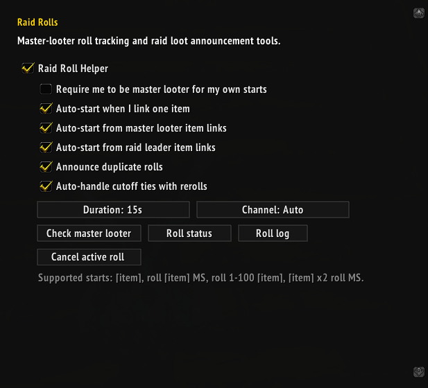
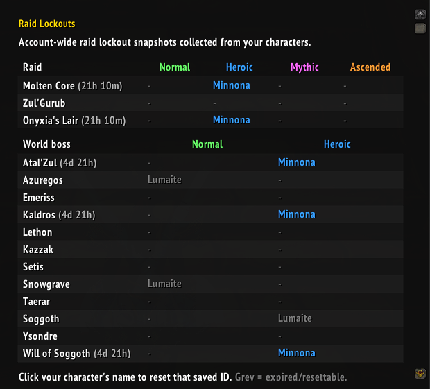

# Minn Tinkers

Minn Tinkers is a collection of lightweight quality-of-life tools for World of Warcraft 3.3.5a on Project Ascension.

## Download

[**Download the latest MinnTinkers.zip**](https://github.com/Minnona/Minn-Tinkers/releases/latest/download/MinnTinkers.zip)

The release archive contains the correctly named `MinnTinkers` addon folder.

## Features

Open the settings with `/minn` or through **Interface → AddOns → Minn Tinkers**.

### Universal

- Smart dungeon rolls, including the Zul'Gurub green/blue Need override
- Optional automatic confirmation for BoP pickups and loot rolls inside dungeons and raids
- Automatic Star/Moon role markers with Mythic+ transition recovery
- Auto-sell grey items and skip safe single-option gossip
- Safe wardrobe and Battleground Spoils confirmation helpers
- Popup protection for invites, summons, resurrection and queue prompts

### Chat

- Mute selected global channels in chosen chat windows inside dungeons, raids or battlegrounds
- Restore every muted channel to its original window after leaving

### Raid Rolls

- Run timed MS/OS item rolls with single- and multi-copy winner support
- Link an item without additional text in Raid Warning to start a roll



### Raid Lockouts

- Track raid and world-boss lockouts across characters on the current realm
- Show difficulty and reset timers in a compact account-wide table
- Click the logged-in character's name to reset an available saved ID



### PvP

- Show clickable friendly and enemy flag-carrier names beside Blizzard's flag UI
- Automatically mark friendly and enemy carriers and release in battlegrounds

### Felsworn

- Vengeful Pact and Man'ari Intuition reminder tools

### Venomancer

- Envenomed Weapons reminder tool

## Installation

### Windows

1. Download `MinnTinkers.zip` from the [Releases section](https://github.com/Minnona/Minn-Tinkers/releases).
2. Extract it into:

```text
C:\AscensionWoW\resources\ascension-live\Interface\AddOns\
```

The final folder should be:

```text
C:\AscensionWoW\resources\ascension-live\Interface\AddOns\MinnTinkers\
```

### Linux

1. Download `MinnTinkers.zip` from the [Releases section](https://github.com/Minnona/Minn-Tinkers/releases).
2. Extract it into:

```text
~/AscensionWoW/resources/ascension-live/Interface/AddOns/
```

The final folder should be:

```text
~/AscensionWoW/resources/ascension-live/Interface/AddOns/MinnTinkers/
```

Use the location of your own AscensionWoW folder if it is installed elsewhere.

## License

Minn Tinkers is licensed under GPL-3.0. Anyone may use, study, modify and redistribute it under the same license.
